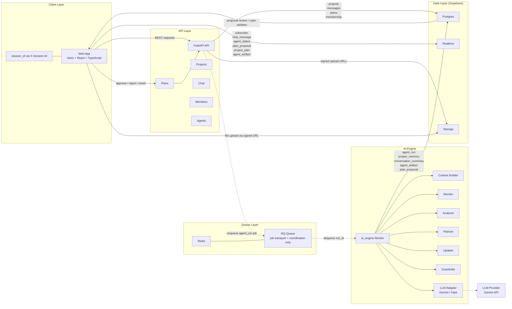

# Orca System Architecture

This document describes the current Orca system architecture in markdown before any diagram-image generation.

## Overview

Orca is split into five runtime concerns:

1. `Web App` for the user-facing workspace UI.
2. `FastAPI API` for HTTP endpoints, permissions, persistence entrypoints, and queue enqueueing.
3. `Redis / RQ` for async job transport and worker coordination.
4. `ai_engine` for context assembly, LLM-backed agent execution, guardrails, and proposal staging.
5. `Supabase` for the source-of-truth data layer, Realtime subscriptions, and file storage.

The important boundaries are:

- The `Web App` talks to the `FastAPI API` and subscribes to Supabase Realtime.
- The `FastAPI API` writes normal product data and enqueues `agent_run` jobs.
- `Redis / RQ` does not own business data; it only carries async work.
- `ai_engine` consumes queued jobs and is the only async runtime that reads/writes AI pipeline records.
- The `LLM Provider` is only called by `ai_engine`, never by Supabase Realtime.

## Diagram

## Runtime Responsibilities

### Web App

- Displays projects, chat, files, AI activity, and plan review UI.
- Sends `X-Session-Id` on every API request.
- Listens to Supabase Realtime for chat, status, proposal, and plan updates.
- Reviews and approves or rejects plan proposals through the API.

### FastAPI API

- Exposes the core HTTP contract for projects, chat, members, plans, and agents.
- Validates project membership and approver permissions.
- Persists user-authored data such as messages and plan approvals.
- Creates `agent_run` rows and enqueues async pipeline work into Redis / RQ.

### Redis / RQ

- Holds queued async jobs for the AI pipeline.
- Coordinates worker pickup and execution.
- Does not store product records or plan state.

### ai_engine

- Loads the queued `agent_run`.
- Builds bounded context from the current plan, new messages, memory, summaries, and file metadata.
- Runs the `Monitor -> Analyzer -> Planner` sequence with guardrails and structured output validation.
- Writes AI artifacts and pending proposals back to Supabase.
- Leaves final plan mutation to the deterministic updater path behind approval.

### Supabase

- `Postgres` stores projects, messages, memberships, plans, run state, memory, summaries, and artifacts.
- `Realtime` streams subscribed table changes to the frontend.
- `Storage` holds uploaded files and signed upload flows.

## Main Flows

### 1. Synchronous product flow

1. The `Web App` calls the `FastAPI API`.
2. The API validates session-based access and writes to Supabase.
3. The frontend receives updates directly from API responses and from Supabase Realtime.

### 2. Asynchronous AI pipeline flow

1. A user message or manual trigger causes the API to create an `agent_run`.
2. The API enqueues that `run_id` into `Redis / RQ`.
3. The `ai_engine Worker` dequeues the job.
4. The worker builds context, runs AI steps, and writes artifacts, memory, summaries, and proposals to Supabase.
5. The frontend sees new activity through Realtime and can review any pending proposal.

### 3. Approval flow

1. The frontend displays the pending `plan_proposal`.
2. An approver sends `approve / reject / revert` through the API.
3. The API applies the deterministic updater path and persists the resulting `project_plan`.
4. Realtime propagates the updated proposal and plan state back to the frontend.

## Architecture Rules

- `ai_engine`, not `Redis`, owns async pipeline business logic.
- `ai_engine`, not `Supabase Realtime`, is the only component that talks to the LLM provider.
- `Supabase` is the source of truth for product and AI-pipeline records.
- `Redis / RQ` is replaceable transport; the persistence model remains in Supabase.
- Plan changes are staged first and only applied through explicit approval.
